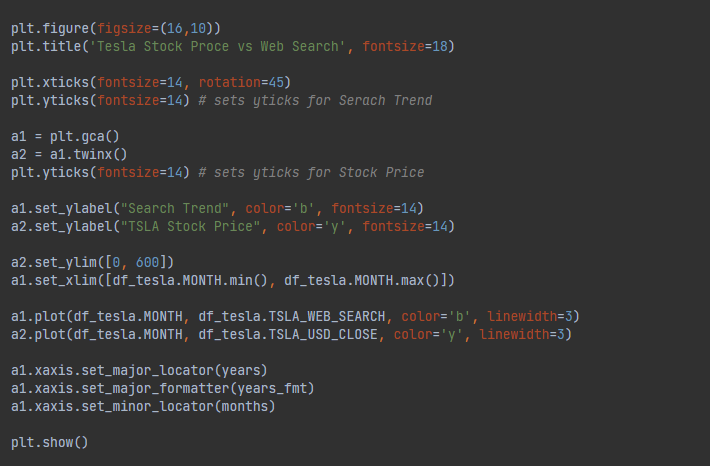
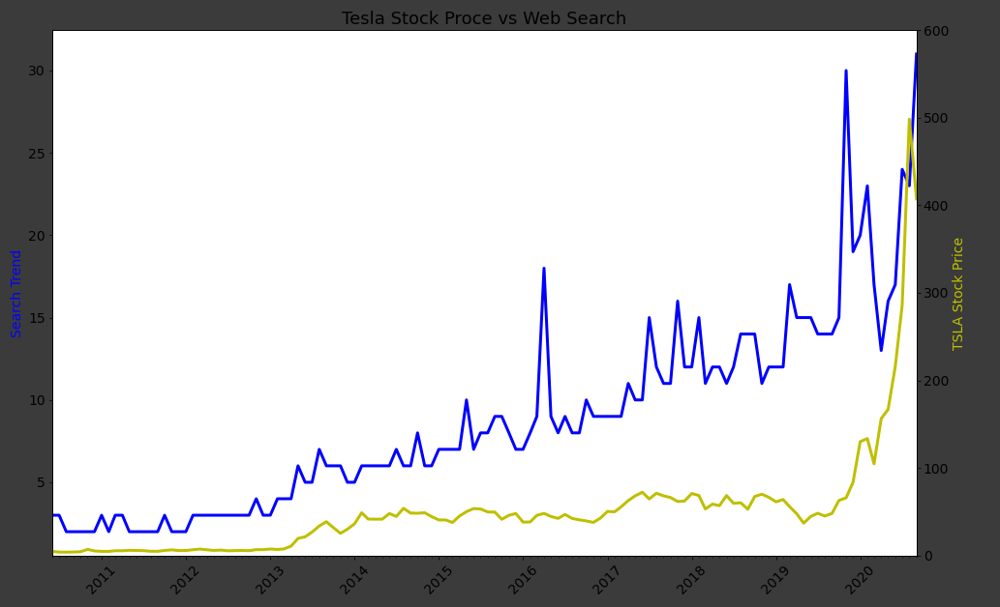
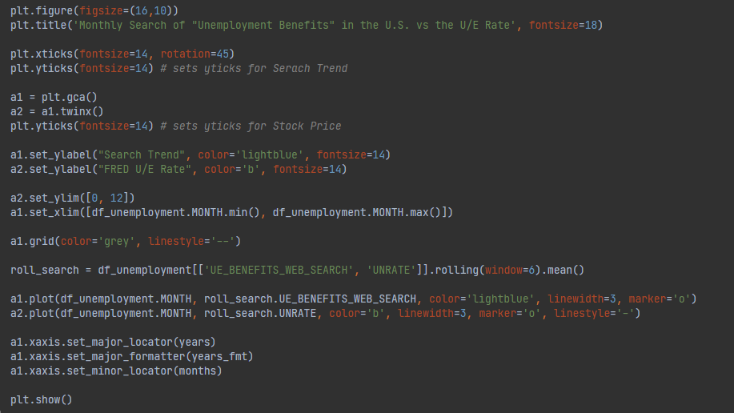
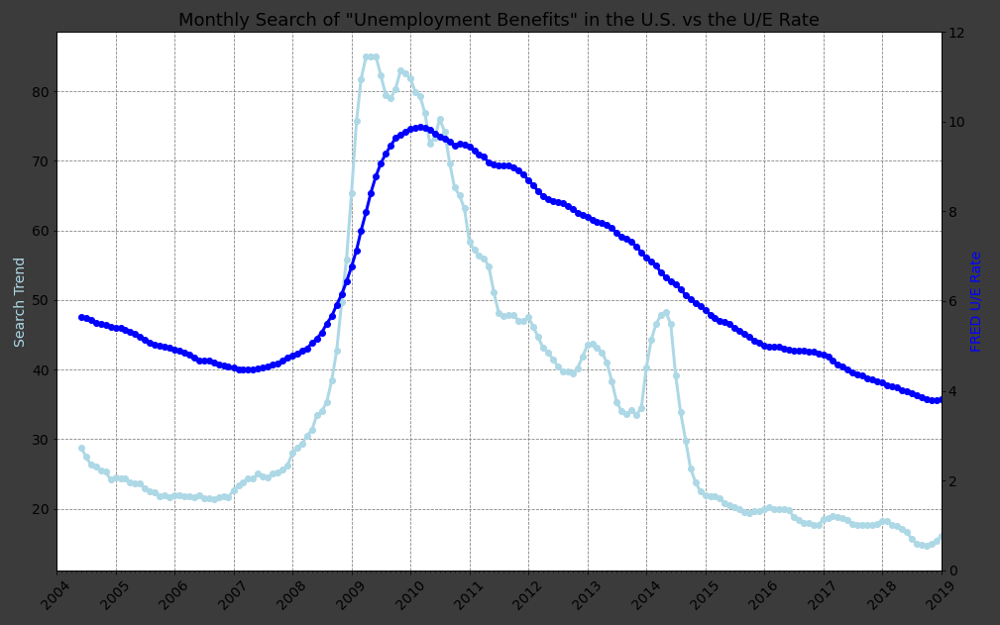

# DataAnalys_GoogleTrends
> Combine Google Trends with other Time Series Data.

## Table of contents
* [General info](#general-info)
* [Screenshots](#screenshots)
* [Technologies](#technologies)
* [Setup](#setup)
* [Status](#status)

## General info
It is one of the Data Analysing projects which is suppoused to hone my skills in that category.

Main goals of the project were:
* Make time-series data comparable by resampling and converting to the same periodicity.
* Fine-tuning the styling of Matplotlib charts by using limits, labels, linestyles, markers etc.
* Using grids to help visually identify seasonality in time series.
* Finding the number of missing NaN values and how to locate Nan values in a DataFrame.
* Work with Locators to better style the time axis on a chart.

As a notebook I used Datalore from Jetbrains.

Data sources:
* [Unemployment Rate from FRED](https://fred.stlouisfed.org/series/UNRATE/)
* [Google Trends](https://trends.google.com/trends/explore)
* [Yahoo Finance for Tesla Stock Price](https://finance.yahoo.com/quote/TSLA/history?p=TSLA&guccounter=1)
* [Yahoo Finance for BTC Stock Price](https://finance.yahoo.com/quote/BTC-USD/history?p=BTC-USD)

It's one of the projects from [Angela's Python Bootcamp](https://www.udemy.com/course/100-days-of-code/)

## Screenshots

## Technologies
* Python 3.8
* Matplotlib 3.4.3

## Setup
Import notebook and data from csv file into one of the Data Science Notebooks (f.e. Datalore).

## Status
Project is: _finished_.
